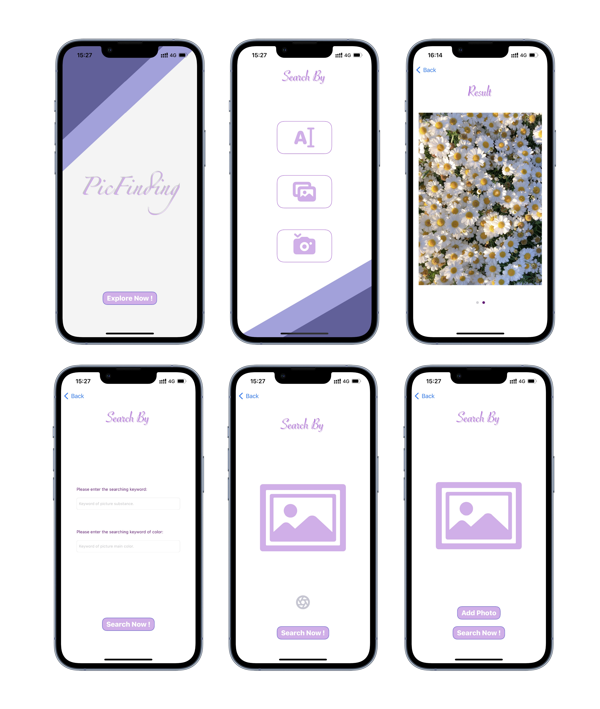
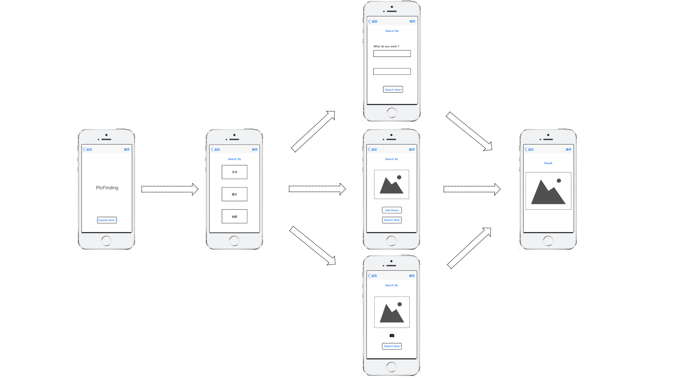

# PicDemo (PicFinding)
This `PicDemo` or in another name `PicFinding` project is an iOS App for my first learning and first development project. It uses three main methods to fetch the desired picture from the Internet, which list as typing the word, taking the picture or just upload an exist picture to do so.
## The main UI outlook of the whole App
We roughly use the `UIKit` to develop our UI layout, and intergrate with a little `SwiftUI`, and the final project layout and design look is showing below.

  

## The main interaction flow of the whole App
Using MVC design pattern we can divide our app into models, views designed with storyboard and the controllers. And the whole user interaction flow is showing below.

  

It's a pritty simple App that with a very easy UI look. And our users can type the tree different searching way buttons to choose the way they want. And the final result view will displayed the 5 pictures that fetch from the Internet by an API.

## Use Notice
This project use a personal use API with a private `Google Search` key, and may out of searching range for using. Therefore, for private reason we delete our private key number to avoide using too much. You can register for a private free account to get limit usage per month and paste your private key in the [K.swift](./PicDemo/K.swift) file which contains the constant key value used in this App. The public API is [Google Search API](https://serpapi.com).

